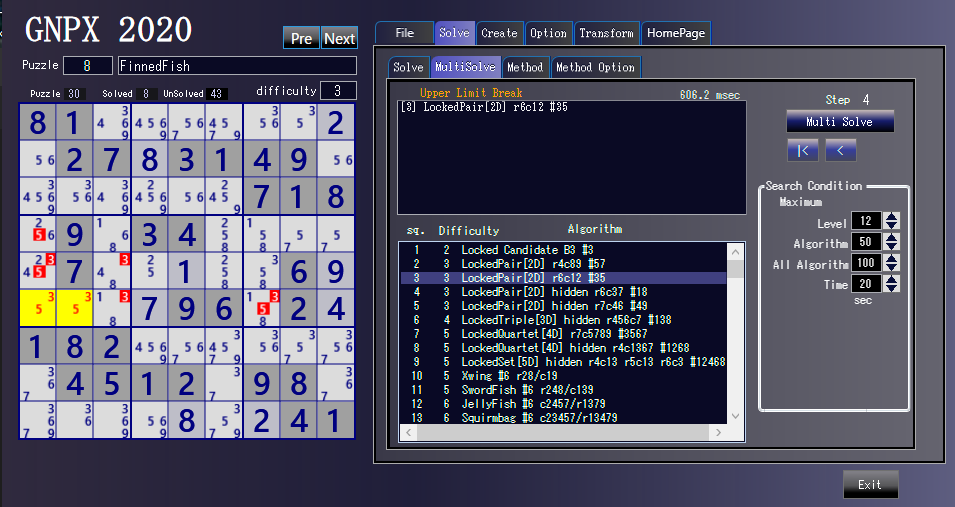
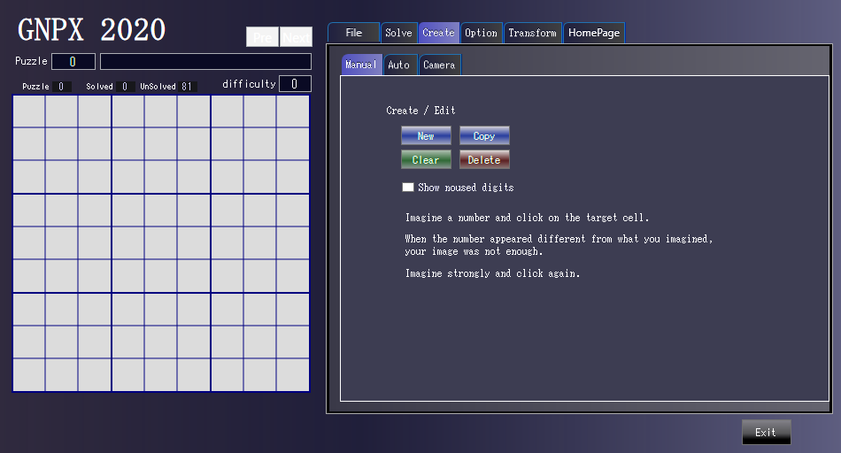
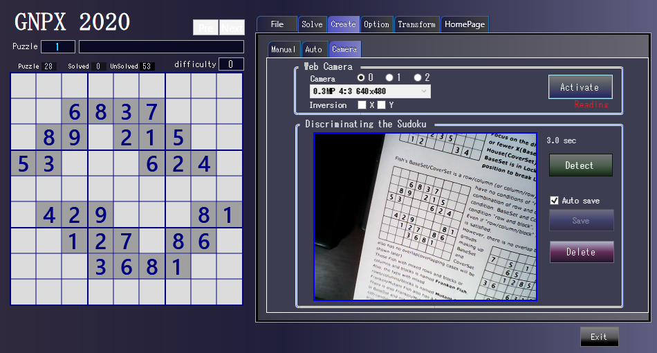
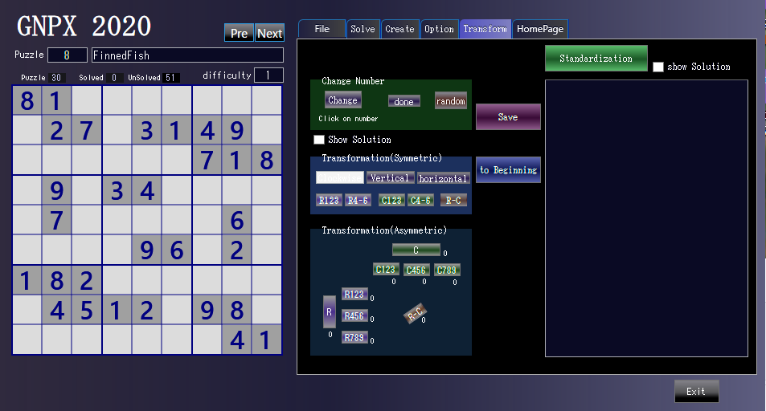
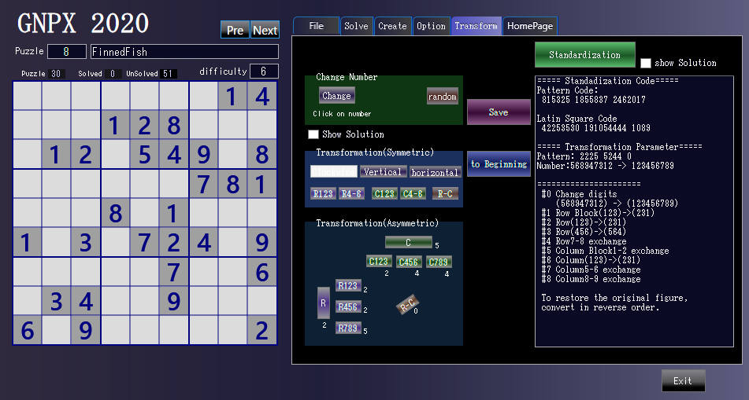

# GNPX manual
- The execution program is SUDOKU_App/GNPX.exe.
- SDK_Methods_V2.txt is the condition definition file.
- Compile with VisualStudio project and place the program in SUDOKU_App folder.
- The camera version requires several DLLs.

# 1. File

## OpenPuzzle File
Load sudoku puzzle file.  
The file format is a sequence of 81 digits, the puzzle is 1-9, and the space is 0/'.'.  
In addition, can also input a file with difficulty etc. as an option.

** Sudoku Data File sampl. (see 'SUDOKU_App/GNPX_1_SAMPLE2.txt')**  
``` data file sample
023000800406080070780300502007008200060020700000650084602590400010004057005001020  
032170608804009070750000000600008457200000006070400000300500084020900500400610702  
000608300007004500600730428060000013004000600000300207518020030403006000296000700  
.3.1.5.8...........8.....2...9.1.2...5.3.9.4..6.....7.7..6.1..851..7..69..8...7..  
...3.9...3.......564.....89.........89..2..51..6.5.8..5.1...7.8.3.5.4.2.7..1.2..3  
4....9.5.23..58.67...4.7.........3253.2....8.5.1...7.....89....9......7..1.72..46 
```

## Save File
Save all Sudoku puzzles as files.  
There are several options. Also, output a list of difficulty levels, solution methods, etc.

## Save to favorities.
Save the current Puzzle to a "favorite" file(SDK_Favorite.txt).

# 2. Solve
The left side shows the puzzle analysis status.
 


## 2.1 Solve / Solve
### Solve / Undo / SolveUp / InitialState
- "Solve" Solve the problem one step. Sometimes the same algorithm determines multiple cells candidates.
- 'Undo' returns state by one step.
- "SolveUp" solves to the complete.
- "InitialState" returns to the initial state  
A description of the applied algorithm is shown in the box above.  
Indicates the number of applied algorithms is shown in the box bellow.


## 2.2 Solve / MultiSolve
### MultiSolve / |< / <
- Find multiple algorithms applicable in the current situation.  
- A description of the selected algorithm appears in the box above. 'Try click selection!'  
  The candidate to be determined differs depending on the algorithm to be selected.  
  'MultiSolve' is an analysis from the results of the selected algorithm.
- The box below lists the applicable algorithms.  
- '|<’ Returns to the beginning.
- '<' Returns to the previous state.


## 2.3 Solve / Method
### Method and Order
- Select the algorithm(Method) used for analysis and set the order.
- To change the order, select an algorithm and move it up/down.
- These settings are saved in the condition file and will be effective at the next startup.
  - The first four algorithms (Single and GeneralLogic) have a fixed selection and order. 
  - Since Single determines the cell number, it cannot be held.  
  - GeneralLogic has equivalent functionality to all other algorithms.
  - Although versatile, it is treated as an option because no efficient method has yet been built. 
  - GeneralLogic is described in more detail on HP.
  - Enable/disable of 'GeneralLogic' and 'ForceChainCell/House' is set by 'Solve/MethodOption'.


### 2.4 Solve / MethodOption
- ALS / Max.Size :Maximum size of ALS(Almost Locked Set) used in the algorithm.
- NiceLoop / Max.Size : Maximum size of (Grouped)NiceLoop used in algorithm.
- Grouped NiceLoop / type : Type to be enabled in grouped NiceLoop.
- Force Chain /
  - The cell/house type of Force_chain is optional because considering whether to accept it as a method.
  - Force_Chain is simultaneously established in different places in one phase. You can choose from three different display methods to see its dynamics.
- General Logic /
  - GeneralLogic is equivalent to all other analysis algorithms. Due to this strength, the activation of GeneralLogic can be specified in the 'MethodOption'.
  - Max.Size is the maximum size of Baseset. A puzzle with Size=3 can be solved in about 1 second, while a puzzle with Size=5 takes several minutes.
  - Rank = (Coverset Size) - (Baseset Size). In GNPX, find the solution from 0 to Max.Size.


# 3. Create
## 3.1 Create / Manual
- You can handcraft the Puzzle in the square on the left.
  - Please strongly imagine one of the numbers 1-9.
  - Click anywhere on the 9x9 grid.
  - When the number appeared different from what you imagined, your image was not enough.
    Imagine strongly and click again.
  - To delete a cell number, click the number again.
- New, Copy, Clear, Delete is what it means.
- Sudoku puzzle consisting of 81 digits can be pasted on the left grid.
  - '.' Is converted to 0, ignoring spaces and CRLF, so it supports puzzles of various formats.
  - This allows you to enter the numbers that appear on the HP puzzle.



## 3.2 Create / Auto
- First, make the desired puzzle pattern.
  - As for the symmetry, there are point symmetry(2 types) and line symmetry (4 types) and no symmetry.
- Click on 'Pattern' to generate a Sudoku puzzle pattern.
   - 'Minimum' is the minimum number of pattern cells.Automatically generate more cells than the minimum number of patterns.
   - 'cells' is the number of cells in the generated pattern.
   - 'Pattern' can be created and modified by clicking on cells. At this time, the symmetry specification works.
   - Import the pattern from the puzzle displayed on the left grid.
- Generate puzzles by specifying the number and difficulty of puzzles.
  - Specify basic pattern changes and randomization.
  - Indicates the status information of the trial.
  - The algorithm applied to generate the puzzle is specified during the analysis phase(Solve/Method).
 


## 3.3 Create / Camera ( "Sudoku_Solver_Generator_withCamera" version )
- Select the "Camera" tab to start the web camera.
  - In a multiple camera environment, 1-3 cameras can be selected.
  - If the camera does not start, 1) Click "Activate", 2) Move to another screen and return, or restart.
  - Invert the image if necessary.
- Click “Detect”.
  - Recognize noisy, distorted, uneven brightness image.
  - If recognized, save automatically or save manually.
  - In case of recognition failure, edit the cell in the left grid directly. Or "Delete".


  
# 4. Option
- Normally, it switches to English and Japanese depending on the PC environment.  
Or manually choose between English and Japanese.
- Specify the random number used when creating the puzzle. If set to 0, the system will set each time.
- ("Omit multiple candidate" is an option for developing a function to speed up. - Delete in the future)
- "Copy" or "Save" the puzzle image in the left grid.
  - The save destination is a dedicated folder in the execution folder.
  - "Solved" and "white background" can be specified for the image type.


# 5 Transform
## 5.1 Transform/Transform
Transform Sudoku puzzle. The Sudoku puzzle that can be converted below is essentially the same as the original puzzle.
- Change numbers in Sudoku puzzles.
  - Click the cells in the order to change to 1-9. "Done" is interrupted before reaching 9.  
    It's okay to click on an already set cell
  - Click "random" to set it randomly. Each click results in a different number puzzle.
- Change the order of rows (columns) and exchange rows and columns.
  - Since the Sudoku puzzle has restrictions on rows, columns, and blocks, the order of rows (columns) cannot be arbitrarily changed.
  - The middle transformation transforms point-symmetric puzzles while preserving symmetry.
  - The lower transformation does not preserve symmetry.
  - The numbers displayed in the lower conversion diagram indicate the types that can be converted. 0 is the original puzzle.
- "Save" saves the converted puzzle.
- "To Beginning" returns to the original puzzle after various returns



## 5.1 Transform/Standardization
Convert to Sudoku puzzle standard form.  
- Definition of standard form and conversion method are shown on HP.  
(In the displayed puzzle, it can be converted to the standard form in 9 steps.)
- The conversion is shown in the lower middle diagram. 
  - Clicking on the displayed number until it becomes 0 will cause the original problem.
  - For transformations involving row and column exchange, a matrix exchange is performed first.
- There are hundreds of millions of puzzles that can be converted, but they can be converted into one standard form.



# 6 HomePage
Jump to HP from the application.


